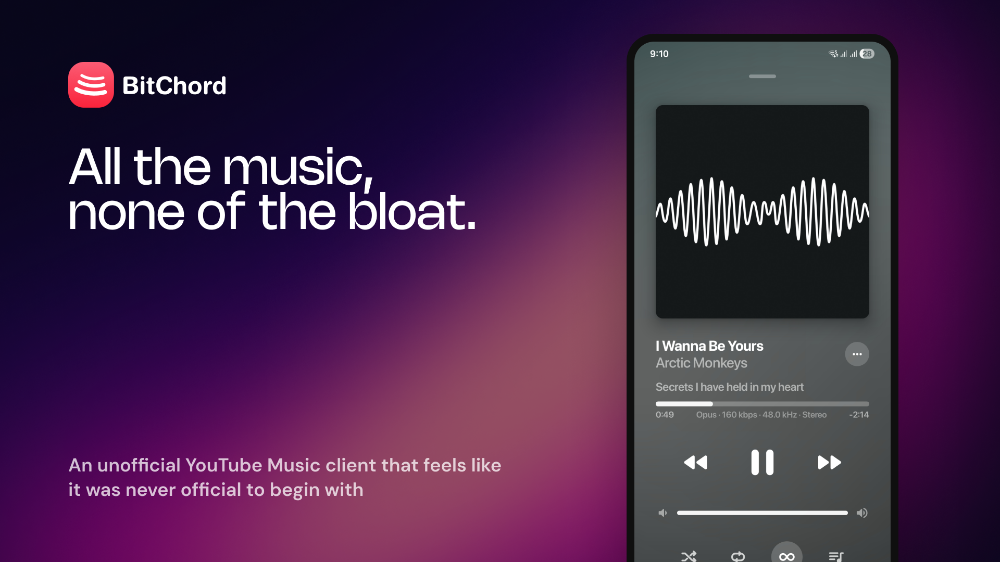

# BitChord - Aesthetic YouTube Music Client



An unofficial YouTube Music client for Android, built with Jetpack Compose. BitChord talks to YouTube Music's own web API (Innertube) directly — no official API key, no ads, no first-party app.

> BitChord is not affiliated with, endorsed by, or connected to YouTube or Google in any way. Use it at your own discretion.

## Features

- **Search, browse and play** anything available on YouTube Music — songs, albums, artists, playlists.
- **Gapless playback with true crossfade**, adjustable 0–12s — two overlapping decoders on an equal-power curve, applied to manual skips as well as track ends, powered by Media3/ExoPlayer.
- **Sign in with your Google account** — an in-app WebView runs the real `accounts.google.com` login (2FA and passkeys work as normal); only the resulting session cookies are captured, never the credential itself.
- **Offline downloads** — save tracks to `Music/BitChord` with title/artist/album/cover art embedded directly into the file, so they read correctly in a file manager or another player, not just inside BitChord.
- **Local music library** — anything already on the device (or previously downloaded) is scanned in alongside what streams from YouTube Music.
- **Scrobbling** to **Last.fm** and **ListenBrainz**, with per-service timing/threshold controls.
- **Per-network audio quality** — separate quality ceilings for Wi-Fi and mobile data.
- **Playback speed control** (0.5×–2.0×) and **skip silence**.
- **Synced lyrics** via LRCLIB, with an optional back-gesture to dismiss the lyrics page.
- **Sleep timer** — fixed presets or "stop after this track".
- **System equalizer** integration.
- **"Stats for nerds"** — codec, bitrate and sample rate overlay on the now-playing screen.
- **Dynamic, artwork-driven theming** — a Material palette extracted from the current album art drives the now-playing background and backdrop washes across the app.
- **Frosted-glass UI** — Telegram-style translucent bars via Haze, Material 3 theming with light/dark/system modes.
- **Background playback** via a proper foreground media session (lock screen controls, notification, Android media controls).

## How it works

BitChord doesn't use YouTube's official Data API. Instead it:

1. Speaks to the same **Innertube** endpoints the `music.youtube.com` web client uses, via a small Ktor-based client (`data/innertube`).
2. Resolves playable audio streams with [NewPipeExtractor](https://github.com/TeamNewPipe/NewPipeExtractor), which handles YouTube's signature/`n`-parameter throttling, falling back across several player clients (including `ANDROID_MUSIC`, which sidesteps `po_token` enforcement) before the extractor is asked.
3. Authenticates by capturing the session cookies from a real Google login (see [`auth/YtMusicLoginScreen.kt`](app/src/main/java/com/music/bitchord/auth/YtMusicLoginScreen.kt)) rather than reimplementing OAuth.
4. Tags downloaded tracks itself — `download/Mp4Tagger.kt` and `download/WebmTagger.kt` write ID3/Vorbis-style metadata and cover art directly into the container, with no external tagging library.

## Tech stack

| Layer | Choice |
|---|---|
| UI | Jetpack Compose, Material 3 |
| Playback | Media3 / ExoPlayer, MediaSessionService |
| Networking | Ktor client + kotlinx.serialization |
| Stream resolution | NewPipeExtractor |
| Images | Coil 3 + Palette |
| Blur / glass effects | Haze |
| Auth storage | AndroidX Security (encrypted prefs) |
| Scrobbling | Last.fm + ListenBrainz, over the existing Ktor client |
| Downloads / tagging | Hand-rolled MP4/WebM muxers — no external metadata library |

Minimum SDK 26, target/compile SDK 36, Kotlin, portrait-only.

## Download

Grab the latest signed APK from the [Releases](../../releases) page. Sideloading requires enabling "Install unknown apps" for whichever app you download it with.

## Building from source

```bash
git clone https://github.com/kushagrasinghx/BitChord.git
cd BitChord
./gradlew assembleDevDebug
```

A debug build needs no extra setup. For a signed release build, create a keystore and a `keystore.properties` (see [`keystore.properties.example`](keystore.properties.example)):

```bash
keytool -genkey -v -keystore bitchord-release.jks \
    -keyalg RSA -keysize 2048 -validity 10000 -alias bitchord
```

Then:

```bash
./gradlew assembleProdRelease
```

The APK lands in `app/build/outputs/apk/prod/release/`. Without `keystore.properties`, the release build still runs but produces an unsigned APK.

### Build flavors

There are two: `dev` and `prod`. They exist only so a build you're working on can sit installed alongside the one you actually listen to — `dev` ships under a separate application id (`com.dev.bitchord`), is labelled "BitChord Dev" in the launcher, and carries a small "Dev" badge next to the logo in the app. `prod` is the shipped package and is what releases are cut from.

The flavourless `assembleDebug` and `assembleRelease` tasks still work, but each builds *both* flavors; name the variant (`assembleDevDebug`, `assembleProdRelease`) to get one APK in one place.

## Project structure

```
app/src/main/java/com/music/bitchord/
├── auth/          Google/YT Music sign-in
├── data/          Innertube client, models, settings, lyrics, local media scan, scrobbling
├── download/       Download queue/service, on-disk store, MP4/WebM metadata tagging
├── playback/       Media3 service, queue, crossfade, sleep timer, cache
└── ui/            Screens (home, search, library, player), theming, components
```

## Contributing

Contributions are welcome — bug fixes, features, or cleanup. Open a PR, or open an [issue](../../issues) first for anything sizable so it can be discussed before you put work into it.

Found a bug or have a feature request? [File an issue](../../issues/new) with as much detail as you can (device, Android version, steps to reproduce, logs if you have them).

## ⚖️ Disclaimer & Legal Notice

BitChord is an independent, community-driven third-party audio player and client. It is **not** associated with Google LLC, YouTube Music, Deezer, Telegram, or any of their parent companies.

* **No Media Hosting:** BitChord does not host, upload, or store copyrighted music files. It operates strictly as an interface to scan local device storage or stream media directly from public, public-facing, or user-authenticated APIs (such as YouTube Music's InnerTube API).
* **Fair Use & API Usage:** This software is created solely for personal research, educational, and fair-use purposes. The user is entirely responsible for ensuring their usage aligns with their local copyright laws and YouTube Terms of Service.
* **No Ad-Blocking Guarantee:** While BitChord focuses on providing a clean listening environment, it does not guarantee permanent bypasses or modifications to commercial third-party platform conditions.
* **Copyleft, Not a Commercialization Ban:** BitChord is free software under the GPLv3 (see below). The license does not let anyone forbid others from selling or redistributing copies — including verbatim copies — but any distribution, commercial or not, must come with the Corresponding Source under the same license.

## 📄 License

This project is licensed under the **GNU General Public License v3.0 (GPLv3)**.

```text
Copyright (C) 2026 Kushagra Singh

This program is free software: you can redistribute it and/or modify
it under the terms of the GNU General Public License as published by
the Free Software Foundation, either version 3 of the License, or
(at your option) any later version.

This program is distributed in the hope that it will be useful,
but WITHOUT ANY WARRANTY; without even the implied warranty of
MERCHANTABILITY or FITNESS FOR A PARTICULAR PURPOSE. See the
GNU General Public License for more details.

You should have received a copy of the GNU General Public License
along with this program. If not, see <https://www.gnu.org/licenses/>.
```

To review the full license text, please check the [LICENSE](LICENSE) file.
